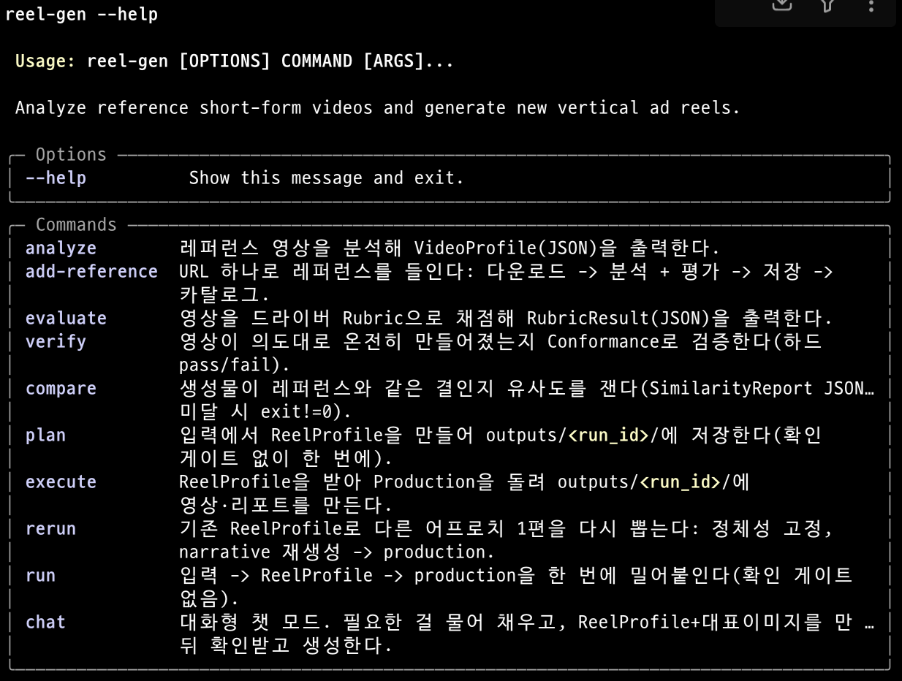
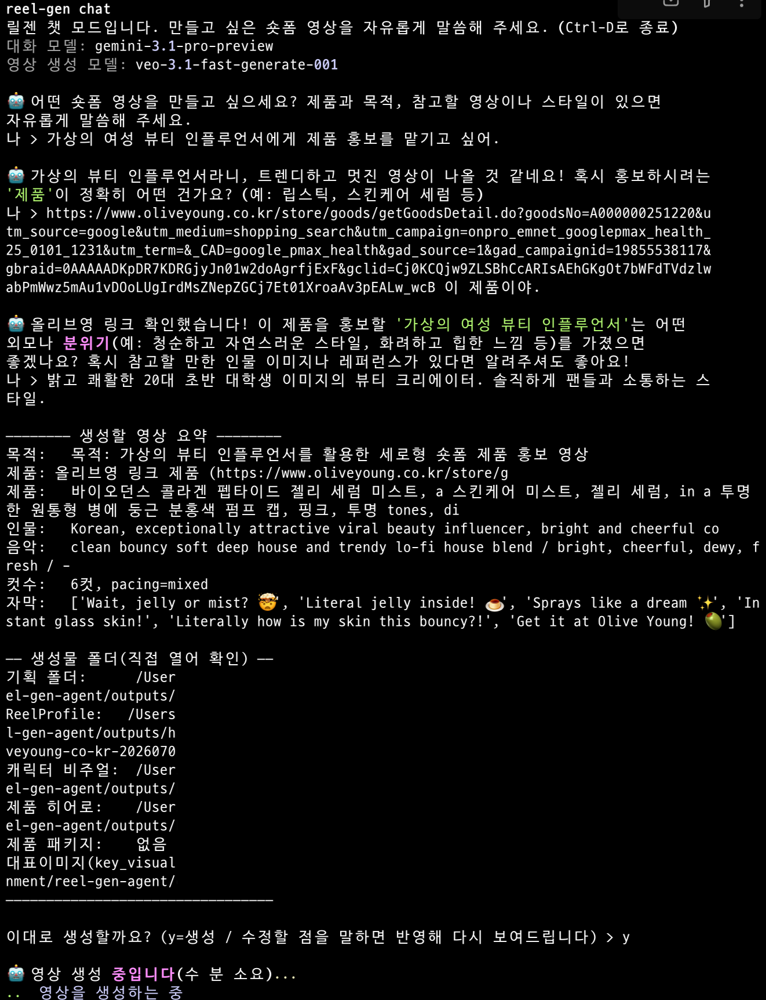

# reel-gen-agent

> 한국어로 보기: [README.md](README.md).

An AI agent CLI that turns a single product into a vertical short for Instagram
Reels, TikTok, and YouTube Shorts. Point it at a product, pick a reference style,
and it produces a one-person short-form mp4 with a model, subtitles, and music.
It is built for solo creators and small brands running short-form product
promotion. Beauty is the main stage (skincare, makeup), and it fits any product a
single person can wear or use indoors on camera, extending to apparel,
accessories, and simple home decor props.

The core idea: do not hardcode a style. Measure it from a reference, express it as
reusable data, and drive generation from that data. Under the hood it separates
analysis from generation through a stable JSON interface, so the generation
backend can change without touching the rest. Bring your own API key and you get
an mp4 with no timeline editor and no render farm.

## Demo results

Same system, different inputs. Two vertical shorts made by swapping only the
product and the reference.

<table>
  <tr>
    <td width="50%" valign="top">
      <video src="https://github.com/shalomeir/reel-gen-agent/raw/main/demo/results/sample4_from_kling_i2v/final.mp4" controls muted></video>
      <p align="center"><b>Sandal sneakers</b><br/>Nike Air Max Isla women's sandal</p>
    </td>
    <td width="50%" valign="top">
      <video src="https://github.com/shalomeir/reel-gen-agent/raw/main/demo/results/sample5_from_kling_i2v/final.mp4" controls muted></video>
      <p align="center"><b>Linen shirt pick</b><br/>Lightweight open-collar summer linen shirt</p>
    </td>
  </tr>
</table>

## Requirements

- Python 3.10+
- `ffmpeg` / `ffprobe` on PATH (used for analysis and video assembly)
- [uv](https://docs.astral.sh/uv/) (install and run)
- **One Google credential** (see below)

### API keys

The agent runs end to end on **a single Google credential**, and it can be either
one.

- **A single `GEMINI_API_KEY` from [Google AI Studio](https://aistudio.google.com/apikey)**
  runs the whole thing: reference analysis, still images (Nano Banana), video
  (Veo 3.1), background music (Lyria 3), and narration (Gemini TTS). No GCP setup,
  no billing project.
- Or fill in **GCP Vertex AI credentials** (`GOOGLE_CLOUD_PROJECT` +
  service-account JSON) instead, and the same Veo/Lyria/analysis run on the Vertex
  lane using Google Cloud credits.
- With both set, `GENAI_BACKEND=auto` prefers Vertex (force it with
  `gemini`/`vertex`).

With no key at all, only `reel-gen analyze --no-gemini` deterministic analysis
works; generation does not.

Optional keys each noticeably improve one part of the output.

| Optional key | What it improves |
|---|---|
| `FAL_KEY` (fal.ai) | Renders video with Kling O3, a clear step up in video quality over the default Veo lane. |
| `ELEVENLABS_API_KEY` | A more natural narration voice (narration mode only). Falls back to Gemini TTS without it. |
| `FIRECRAWL_API_KEY` | Much better product recognition from a reference URL (a shop product page, etc.). |
| `ANTHROPIC_API_KEY` | Runs the storyboard / dialogue / tone text lane on Claude Opus. |

The full variable list, defaults, and sources are in [`.env.example`](.env.example).

## Install

This tool ships no prebuilt binary. Clone the repository and install its
dependencies with `uv`.

```bash
# 1. Clone
git clone https://github.com/shalomeir/reel-gen-agent.git
cd reel-gen-agent

# 2. ffmpeg (macOS)
brew install ffmpeg

# 3. Install deps (uv creates .venv and installs the reel-gen command)
uv sync                        # with dev tools: uv sync --extra dev

# 4. Prepare the env file
cp .env.example .env           # open .env and fill in your API key
# GEMINI_API_KEY=...           # one Google AI Studio key is enough to start

# 5. Verify
uv run reel-gen --help
```

Activate the virtualenv to call `reel-gen` directly, or wrap each call with
`uv run reel-gen ...`. Update with `git pull && uv sync`.

```bash
source .venv/bin/activate      # activate once
reel-gen --help                # then call without uv run
```

## Usage

List commands with `reel-gen --help`. See a command's options with
`reel-gen <command> --help`.



### Generate a video: `run`

Takes one input, builds a `ReelProfile`, and pushes to a video in one go. There
are no confirm gates (HITL), and it rejects input with no clear video purpose. You
can run it straight from the clone with the bundled sample input.

```bash
# Run directly with the bundled sample input
reel-gen run ./demo/sample_input_1.json

# Run from a natural-language brief (mix URLs/local paths; they are classified as
# reference / product / character)
reel-gen run "Make a playful 15s unboxing reel for this product.
product: https://brand.example/serum
reference video: ./reference_video/fast-cut.mp4
character: https://example.com/model.jpg"
```

Input comes in three forms: a text brief, a JSON file path
(`generation_input.json` or a finished `ReelProfile`), or a single asset (image,
video, URL). The system detects which. With a reference, `--max-iters` re-analyzes
the output, compares similarity, and re-plans/re-generates on a shortfall using
per-axis deltas as feedback.

### Interactive chat mode: `chat`

Asks what it needs, fills the input, shows a summary and a key visual for one
confirmation, then generates. It is intake plus a single confirm (not per-stage
gates), so it converges to `run`.

```bash
reel-gen chat                          # start from an empty conversation
reel-gen chat "glow serum morning routine reel"   # seed a brief, then keep chatting
```



### Analyze and score references

```bash
# Analyze a reference video into a VideoProfile (JSON); local path or URL
reel-gen analyze path/to/video.mp4
reel-gen analyze path/to/video.mp4 --no-gemini   # deterministic layer only, no key

# Score content effectiveness on the driver rubric (same ruler for refs and outputs)
reel-gen evaluate path/to/video.mp4
```

`analyze` adds Gemini perceptual labels (tone, feel, subtitle style, hook) on top
of deterministic measurements (cut distribution, audio dynamics, color, brightness).
`evaluate` combines hook/watch-completion as a multiplicative gate with the rest as
a weighted core into a 0-100 score: whether the clip works as content, not whether
it resembles a reference.

## Outputs

Results collect under `./outputs/<run_id>/`. `run_id` is `concept-slug-timestamp`.

```
outputs/<run_id>/
├── plan/
│   ├── ReelProfile-<run_id>.json   # frozen plan (the key file, input to rerun)
│   └── ...                         # character/product/anchor stills and other plan artifacts
├── execute/                        # production intermediates (stills, per-cut clips, audio)
├── final.mp4                       # the final video
├── report.md                       # run report (models used, node flow, scores, cost estimate)
├── upload.md                       # upload kit (title, caption, hashtags)
└── run.json                        # RunManifest (execution record, applied fallbacks)
```

- **`plan/ReelProfile-<run_id>.json`**: the frozen plan. A portable creative intent
  holding the concept, style, assets, storyboard, hook, and production intent in one
  file. The same ReelProfile makes a similar video.
- **`final.mp4` / `report.md` / `upload.md`**: the final video, the run report, and
  the upload kit for posting, all at the run root.
- **`execute/`**: production intermediates: anchor stills, per-cut video clips, audio.

If you already have a `ReelProfile`, you do not need to re-run the front stages.

```bash
# Skip planning and render a ReelProfile straight to video
reel-gen execute outputs/<run_id>/plan/ReelProfile-<run_id>.json

# Keep the product/character identity, re-roll hook -> story -> music into a new folder
reel-gen rerun outputs/<run_id>/plan/ReelProfile-<run_id>.json
```

`rerun` keeps the identity fixed and regenerates only the hook, storyboard, and
music to produce a fresh video.

### Time and cost

About 10 minutes per reel (analysis ~30s, plan ~2min, execute ~6min), and around
**$2-$3** for a 15-second short (stills, BGM, narration included). It is a
public-rate estimate, not an actual bill; the run report prints the per-model
estimate.

## Further reading

- [analysis.md](analysis.md): development process and technical analysis:
  plan/production implementation, the LangGraph structure, and model choices.
- [retro.md](retro.md): retrospective: assumptions, blockers, limits, and what to
  improve next.
- [specs/project-brief.md](specs/project-brief.md): product intent and success
  criteria (the root vision).
- [specs/workflows.md](specs/workflows.md): **the LangGraph StateGraph structure.**
  The authoritative definition of the agent's backbone (two phases, nodes, gates).
- [specs/ai-model-records.md](specs/ai-model-records.md): model choices per use and
  the rationale.
- [docs/ToolnModels.md](docs/ToolnModels.md): which models, APIs, and libraries were
  chosen and why.
- [docs/hook-insight.md](docs/hook-insight.md): reference material for the hook
  generation logic.
- [docs/rubric.md](docs/rubric.md): background for the `evaluate` scoring.
- Also [specs/prd.md](specs/prd.md) (requirements), [specs/trd.md](specs/trd.md)
  (technical contract), [specs/hook-generator.md](specs/hook-generator.md) (hook
  contract), [specs/information-schema.md](specs/information-schema.md) (schemas),
  and [specs/product-design.md](specs/product-design.md) (CLI/UX).

## License

MIT. See [LICENSE](LICENSE).
