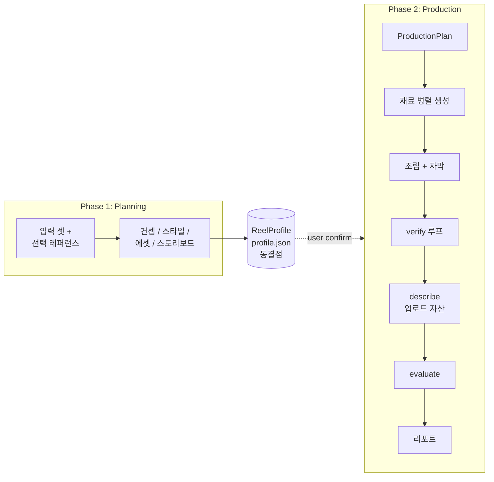
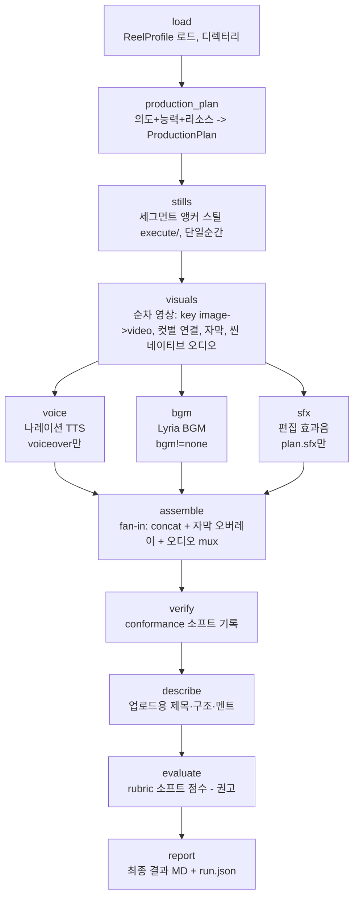

# 워크플로우: LangGraph StateGraph

상태: 확정(설계). 이 문서는 코어 LangGraph 그래프의 노드, 각 노드의 주요 task, 그리고
흐름을 정한다. 무엇을 만드는지는 [prd.md](prd.md), 사용자 경험과 게이트는
[product-design.md](product-design.md), 기술 스택은 [trd.md](trd.md), 단계 내부의
세부 계약은 [../docs/pipeline-design.md](../docs/pipeline-design.md)에 있다. 이 문서가
그래프 구조의 정본이다. 스키마는 `src/reel_gen_agent/generate/schema.py`가 정본이고,
이 문서가 요구하는 신규 스키마는 아래 "신규 스키마" 절에 명시한다.

> **개정(2026-07-01): 현재 구현 그래프.** 실제 코드(`plan_graph.py`/`execute_graph.py`)는
> 아래 초기 설계에서 다음이 달라졌다.
> - **그래프 안 노드별 게이트 없음**: 두 그래프는 확인 단계 없이 입력→ReelProfile→production
>   일괄로 돈다(run). 사람 확인은 그래프 밖 `chat` 명령이 담당한다(대화형 인테이크 +
>   ReelProfile·대표이미지 확인·수정 루프 후 생성, 구현 완료).
> - **plan 그래프**: 통합 `assets` 노드를 제거하고 **character·product 노드가 각자 그 단계에서
>   에셋(캐릭터 시트·제품 히어로/패키지)을 생성**한다. 환경은 스펙만(이미지 없음).
> - **execute 그래프**: `visuals`(순차 영상 생성: key image→video, 컷별 이전 컷 연결, 씬 오디오
>   함께 생성) → **`voice`·`bgm`·`sfx` 3개 오디오 노드를 병렬(fan-out)** → `assemble`(fan-in)로
>   합침. 각 오디오 노드는 plan 플래그로 self-gate(voiceover만 voice, plan.sfx만 sfx, bgm은 거의
>   항상). 씬 자연음은 영상 모델이 내고, ElevenLabs SFX는 비-diegetic 편집 효과에만 옵션.
> 아래 본문(머메이드·노드 서술·로드맵)은 이 개정에 맞춰 갱신됐다. 미룬 항목(그래프 안
> 노드별 HITL 게이트·verify 하드+repair 루프 등)은
> [../docs/Retrospective.md](../docs/Retrospective.md) 3절에 정리한다.

## 한 줄 요약

그래프는 두 페이즈다. **기획(Planning)**이 입력 셋을 받아 에셋과 스토리보드를 거쳐
`ReelProfile`(= profile.json)로 동결되고, 사용자가 확인하면 **생산(Production)**이
그 profile을 받아 영상 모델 능력에 맞춰 재료를 병렬로 만들고 합친 뒤 검증한다. profile은
이식 가능한 창작 의도이고, 생산은 가용 리소스에 맞춰 그 의도를 해소한다. 같은 profile은
유사한 영상을 만든다.

## 두 페이즈와 동결점



- **동결점은 `ReelProfile`(profile.json) 하나다.** 기획의 모든 부산물(컨셉, 5가지 스타일
  차원, 내러티브 아크, 에셋 바이블, 스토리보드/콘티, 후크, 생산 의도)을 한 합본에 담는다.
  같은 profile이 들어오면 유사한 영상이 나와야 한다.
- **이식 의도 vs 실행 계획 분리.** `ReelProfile`은 *원하는* 생산 의도(voice 전략 선호,
  멀티샷 선호 등)만 담아 머신과 무관하게 이식된다. 런타임 `ProductionPlan`이 그 의도를
  가용 리소스(키, 모델 능력)에 맞춰 해소하고, 적용한 폴백을 `RunManifest`에 기록한다.

## 명령 매핑 (plan / execute / run)

두 페이즈는 명령으로 분리 실행한다. CLI 계약의 정본은 [product-design.md](product-design.md).

| 명령 | 도는 페이즈 | 입력 -> 산출 |
|---|---|---|
| `plan <입력>` | Planning | 입력 -> `ReelProfile-{컨셉}-{생성일시}.json` |
| `execute <ReelProfile>` | Production | ReelProfile -> 영상 + report + upload |
| `rerun <ReelProfile>` | Planning(재전개) + Production | 기존 ReelProfile -> 정체성 고정, 레퍼런스 무시하고 style부터 재생성 -> 새 폴더 영상 |
| `run <입력>` | Planning + Production | 입력 -> 영상까지 한 번에 |
| `chat [시드]` | Planning + Production | 대화형으로 입력을 채우고 ReelProfile·대표이미지를 확인·수정 루프로 다듬은 뒤 생성(구현 완료) |

`rerun`은 Planning의 narrative 부분만 다시 도는 `replan` 서브그래프(`generate/replan_graph.py`)를
쓴다. 흐름은 `style(초안) -> hook <-> storyboard -> style_refine(보정) -> narration -> music`이며,
정체성 노드(product/character/environment)는 건너뛴다. 계약은 [replan.md](replan.md)가 정본이다.

두 페이즈는 `ReelProfile` 스키마로만 통신한다. 그래서 plan과 execute를 독립으로 개발하고
독립으로 실행할 수 있다(스키마 경계, [ADR.md](ADR.md) ADR-0003).

## 그래프 상태 (GraphState)

노드는 공유 상태를 읽고 쓴다. 핵심 필드:

| 필드 | 타입 | 의미 |
|---|---|---|
| `objective` | Objective | 영상 목적(필수). 없으면 그래프 진입 불가 |
| `character_input` | AssetInput \| None | 캐릭터 입력(이미지/URL/설명). 없으면 의도 캡처 |
| `product_input` | AssetInput \| None | 제품 입력. 없으면 의도 캡처 |
| `reference_ref` | str \| None | 선택 레퍼런스 영상/URL |
| `style_profile` | VideoProfile \| None | 레퍼런스 분석 산출 또는 LLM 유도 |
| `asset_bible` | AssetBible \| None | 캐릭터/제품 에셋 시트 |
| `storyboard` | Storyboard \| None | 패널 목록 + 콘티 |
| `reel_profile` | ReelProfile \| None | 기획 동결 산출(profile.json) |
| `production_plan` | ProductionPlan \| None | 런타임 해소 실행 계획 |
| `materials` | Materials | 생성된 재료(샷 클립, voice, bgm, sfx, 자막 PNG) |
| `manifest` | RunManifest | 노드별 실행 기록, 폴백, 산출물 경로 |

## Phase 1: Planning

구현된 LangGraph(`generate/plan_graph.py`, `StateGraph(PlanState)`)의 실제 노드·엣지다.
각 노드는 공유 상태(PlanState)를 읽고 부분 업데이트를 돌려주며, Tracer가 노드 span을 로컬
trace(+옵션 Langfuse)에 남긴다([trace.py], [ADR.md] ADR-0013).

```mermaid
flowchart TD
    intake[intake<br/>입력 판별·검증] --> ref[reference_seed<br/>있으면 analyze -> 스타일·메타·음악·컷·인물·제품 시딩]
    ref --> product[product<br/>제품 분석 + 제품 히어로·패키지 이미지 생성 plan/]
    product --> char[character<br/>캐릭터 도출 + 캐릭터 시트 이미지 생성 plan/, 기본 매력적 미인]
    char --> env[environment<br/>장소·조명·무드 LLM 결정, 텍스트만]
    env --> style[style 초안<br/>hook·story 앞에서 style을 반드시 채움: 레퍼런스면 측정 유지, 없으면 LLM 저술]
    style --> hook[hook<br/>유형·문구 LLM, 레퍼런스 시각 반영]
    hook --> story[storyboard<br/>숏폼 전문가 LLM: 서사 컷·행동·카메라·자막]
    story -- hook 부적합 & 재시도여유 --> hook
    story -- 적합 --> refine[style 보정<br/>확정 hook·story 극대화, 레퍼런스 없을 때만]
    refine --> narr[narration<br/>캐릭터 페르소나 대사]
    narr --> music[music<br/>장르·무드·다이내믹·prominence, 확정 서사 보고 마지막]
    music --> write[write_profile<br/>에셋 조립 + ReelProfile 동결 plan/]
```

**hook ↔ storyboard 핑퐁(나중 추가).** storyboard 노드가 주어진 hook을 전체 스토리에
녹여보고, 훅이 스토리를 잘 못 열면 `hook_fits=false`와 개선 힌트를 낸다. 조건부 엣지가 그
힌트로 hook 노드를 다시 부르고(최대 `MAX_HOOK_ATTEMPTS`회) storyboard를 재실행한다. 이렇게
"훅과 스토리보드를 함께" 맞춰 나간다. LLM이 없으면 storyboard는 결정론 템플릿으로 폴백하고
핑퐁 없이 통과한다.

그래프 안 노드별 HITL 게이트(ask/pass/run)는 설계에만 있고 미구현이다. plan 그래프는 게이트
없이 끝까지 돈다(run 모드와 동등). 사람 확인은 그래프 밖 `chat` 명령이 ReelProfile 확인·수정
루프로 제공한다(아래 "게이트 동작" 참고).

### 노드와 주요 task

노드 순서는 위 mermaid와 `generate/plan_graph.py`가 정본이다. 원안의 `concept`·`ask_intent`
노드와 대사·자막·음악을 묶은 단일 `scripting` 노드는 구현에서 별도 노드로 두지 않았다. 컨셉
판단은 `reference_seed` 시딩과 각 노드의 LLM 결정에 흡수됐고, 대사·자막·음악은 아래
`storyboard`(자막)·`narration`(대사)·`music`(마지막) 세 노드로 나뉜다. **style은 hook·story를
앞에서 이끌도록 초안 노드로 항상 채우고, 핑퐁이 끝난 뒤 확정 서사를 극대화하도록 보정
노드를 한 번 더 둔다(레퍼런스 없을 때).** **에셋 이미지도
통합 `assets` 노드 없이 `product`·`character` 노드가 각자 그 단계에서 생성하고,
`write_profile`이 그 산출과 환경 스펙을 `AssetBible`로 조립한다.** 그래프 안 노드별 HITL
게이트는 미구현이다. 누락 입력 확인은 그래프 밖 `chat`의 대화형 인테이크가 담당한다(아래
"게이트 동작" 참고).

- **intake (입력 판별·검증)**: 입력 셋을 판별한다. `objective`(영상 목적)는 필수이고
  없으면 진입을 막는다. `product`는 이름만 우선 세팅하고(뒤의 product 노드가 채운다),
  `meta`/`style`/`music`은 기본값, `delivery`는 기본 `voiceover`, `provenance`는 레퍼런스
  유무로 `style_source`(reference/llm)를 잡는다. **기본 로케일은 영어·미국 base다.** 특별한
  언급이 없으면 영상 언어는 영어(`meta.language="en"`), 대사·자막·캐릭터·배경은 미국을
  기준으로 잡는다. 다른 언어나 지역은 입력이 명시할 때만 바꾼다.
- **reference_seed (선택)**: `reference_ref`가 실제 파일로 존재하면 `seed_from_reference`로
  분석해 `meta`/`style`/`music`/`cut_count`/`delivery`와 레퍼런스 관측(인물, 후크, 제품,
  voice 톤·pace)을 시딩한다. 컷 리듬만이 아니라 **ReelProfile 베이스라인 전체의 씨앗**이다
  (톤, 페이싱, 컷 리듬, 자막 스타일, 후크, 음악 스타일/다이내믹, 내러티브 아크, 기본
  스토리보드 구조). 레퍼런스가 없거나 시딩이 실패하면 기본값으로 계속한다.
- **product (제품 분석 + 제품 에셋)**: 이름만 든 `ProductSpec`을 카테고리·USP·용기·행동
  (`affordances`)으로 채운다(목적 + 레퍼런스 제품 힌트 + LLM). **이어서 이 노드에서
  `build_product_asset`으로 제품 히어로샷·패키지샷을 나노바나나로 생성**해 `ProductProfile`을
  만든다(이미지 클라이언트 없거나 실패하면 이미지 없이 진행). 스토리보드가 사용 장면에,
  execute 컷별 스틸이 이 히어로 이미지를 reference·폴백으로 쓴다. 기획·카피 LLM은
  [ai-model-records.md](ai-model-records.md) 2번을 따른다.
- **character (캐릭터 도출 + 캐릭터 에셋)**: 목적·제품·레퍼런스 인물 관측에서 `ModelSpec`
  (성별·나이·look·무드)을 도출한다. 사용자가 정하지 않으면 기본은 매력적 미인이다. **이어서
  이 노드에서 `build_character_asset`으로 캐릭터 정면 시트샷을 나노바나나로 생성**해
  `CharacterProfile`을 만든다. 이 캐릭터 이미지는 execute 컷별 스틸·멀티샷 일관성의 근거다.
- **environment (환경 정의)**: 목적·제품·캐릭터에 맞는 `EnvironmentSpec`(장소·조명·시간대·
  무드·배경 소품)을 **텍스트로만** 정의한다. 캐릭터·제품과 함께 잠금 에셋이라 모든 샷이 이
  환경을 참조한다. **이 노드는 character(에셋 생성) 뒤에 돌기 때문에 캐릭터 이미지에는
  반영되지 않는다.** 환경 스펙은 `write_profile`에서 `AssetBible.environment`로 들어간다.
  별도 환경 레퍼런스 이미지 생성은 향후로 미룬다([../docs/Retrospective.md](../docs/Retrospective.md)).
- **style (스타일 초안, 핵심 노드)**: hook·story 앞에서 style(tone·pacing·motion·palette·
  realism)을 반드시 채운다. style은 hook·story·music·execute를 모두 좌우하는 축이라 절대
  비워 두지 않는다. 레퍼런스가 있으면 `reference_seed`의 측정 style을 정본으로 유지하고,
  없으면 LLM이 목적·제품·캐릭터로 예비 style을 저술한다(LLM도 없으면 결정론 기본값). 저술
  프롬프트는 [../docs/refer-insight.md](../docs/refer-insight.md)의 레퍼런스 인사이트를 런타임에
  읽어 방향 참고로 얹는다(값을 못박지 않고, 기본값 수렴·과도한 할인 톤을 피하도록). 진입은
  `generate/style.py::author_style`. style.hook은 hook 노드 몫이라 여기선 건드리지 않는다.
- **hook (후크 생성)**: 첫 1~3초 후크 전용 노드다. 계약은 [hook-generator.md](hook-generator.md),
  배경·유형·예시는 [../docs/hook-insight.md](../docs/hook-insight.md)다. `HookRequest`(제품,
  톤, 캐릭터, 언어, 길이)에서 LLM이 유형(H1~H12)을 골라 텍스트·비주얼·오프닝 비트를
  **비결정적(temperature)**으로 생성한다(필수 요건). 진입 함수는
  `generate/hook.py::generate_hooks`다. 현재 구현은 후보 2개를 만들어 **0번을 자동 채택**한다
  (후보 확인·편집·선택 HITL은 향후). 레퍼런스가 있으면 첫 3초 비주얼·문구·윈도를 채택 후크에
  얹는다(유형은 LLM 선택 유지). storyboard가 반려하면(`hook_feedback`) 그 힌트를 브리프에
  실어 재생성한다.
- **storyboard (콘티)**: 입력 + `style_profile`(컷 수·타이밍 시딩) + 캐릭터·제품·환경 + 후크를
  합쳐 패널 목록과 콘티를 만든다(`plan_story_panels` LLM, 없으면 `build_storyboard` 결정론
  폴백). 패널 0은 항상 후크다. **패널별 자막 스크립트(`subtitle_text`)도 이 노드가 채운다**
  (컷마다 핵심 키워드형, 원안 scripting의 자막 역할이 여기로 왔다). 컷 수·타이밍은 레퍼런스가
  있으면 `style_profile` 컷 데이터로, 없으면 페이싱(fast_montage/mixed/slow_demo)으로 시딩한다.
  - **hook ↔ storyboard 핑퐁**: storyboard가 주어진 후크로 스토리가 잘 안 열리면
    `hook_feedback`을 내고, 조건부 엣지가 최대 `MAX_HOOK_ATTEMPTS`(2)회 hook을 다시 부른다.
    LLM이 없으면 결정론 템플릿으로 폴백하고 핑퐁 없이 통과한다.
- **style_refine (스타일 보정)**: 핑퐁이 끝난 뒤 확정된 hook·story를 극대화하도록 style을
  다시 다듬는다(레퍼런스 없을 때만, `rerun`도 포함). style이 콘텐츠를 앞에서 이끌고 뒤에서
  맞추는 두 접점을 갖는다. 레퍼런스면 측정 style이 정본이라 no-op, LLM이 없으면 초안 유지.
  진입은 `generate/style.py::author_style`(storyboard를 함께 넘겨 보정 모드로 돈다).
- **narration (대사 스크립트)**: storyboard 뒤에서 대사(나레이션)를 만든다. `delivery`는 기본
  `voiceover`([ADR.md](ADR.md) ADR-0012). **voice는 캐릭터(`ModelSpec`)에서 유도한
  `VoiceSpec`으로 만든다(매우 중요)**: `from_character`, 음색은 `voice_persona`, 톤·pace는
  레퍼런스 관측을 우선 싣는다. LLM이 있으면 패널 비트별로 `narration_lines`를 채우고,
  `narrative_arc`는 패널 beat에서 만든다. 실제 TTS 생성은 execute의 `voice` 노드가 한다. 원안의
  단일 scripting 노드는 이렇게 music·storyboard·narration 세 노드로 분리 구현됐다.
- **music (음악 정의)**: 장르·무드·다이내믹·prominence를 정한다(목적·제품·톤·페이싱·캐릭터
  + LLM). **narration 뒤, plan의 마지막 노드다**(확정 서사·훅·나레이션을 보고 정한다). 실제
  BGM 생성·믹스는 execute의 `bgm` 노드가 한다.
- **write_profile (에셋 조립 + 동결)**: 통합 assets 노드가 없으므로 여기서 `product`·
  `character` 노드가 만든 `ProductProfile`·`CharacterProfile`과 environment 스펙을 `AssetBible`로
  조립한다(에셋이 없으면 이름만 든 프로필로 폴백). 이미지 경로는 plan/ 기준 상대명이라 ReelProfile이
  이식 가능하다. 그다음 위 모든 산출을 `ReelProfile`(profile.json)로 동결해 plan/에 쓰고, 스타일
  출처(reference/llm)·레퍼런스 참조·시드·사용한 텍스트 모델을 provenance로 남긴다.

## Phase 2: Production

구현된 LangGraph(`generate/execute_graph.py`, `StateGraph(ExecState)`)의 실제 노드·엣지다.
영상 생성(`visuals`)은 순차이고(key image -> video, 컷별로 이전 컷 연결, 씬 네이티브 오디오
함께 생성, 멀티샷 ≤2회 호출 [multishot-segments.md]), 그 뒤 **`voice`·`bgm`·`sfx` 세 오디오
노드가 정적 엣지로 fan-out 병렬 실행**되고 `assemble`이 fan-in으로 합친다. 각 오디오 노드는
`ProductionPlan` 플래그로 self-gate한다(voiceover일 때만 voice, `plan.sfx`일 때만 sfx, bgm은
`plan.bgm!=none`이면). verify->repair 유한 루프는 아직 미구현(verify는 소프트 기록만) — 향후로
미룬다([../docs/Retrospective.md](../docs/Retrospective.md)).



산출물 배치: plan 산출물은 `plan/`(ReelProfile·캐릭터·제품), execute 생성물은
`execute/`(앵커 스틸·클립·오디오), 결과물 3종(final.mp4/report.md/upload.md)+run.json은 run
루트에 둔다.

### 노드와 주요 task

- **production_planner**: `ReelProfile`의 생산 의도를 받아, 선택된 영상 모델의
  **capability matrix**(멀티샷 지원, voice 동시 생성 지원, 최대 클립 길이, 해상도)와
  가용 리소스(키, 예산)에 맞춰 `ProductionPlan`을 해소한다. 결정 항목:
  - **voice 전략**: `voiceover`=별도 TTS 나레이션(**기본**) / `on_camera`=모델 네이티브 발화 /
    `none`=없음. voice는 되도록 켜되 기본은 voiceover다. `delivery=on_camera`인데 컷이
    여럿이면 목소리 일관을 위해 Kling O3 Pro reference-to-video를 요구하고, 그 백엔드가
    없으면 voiceover 나레이션으로 안전하게 내려간다.
  - **멀티샷**: 한 번에 멀티샷 호출 vs 샷별 짧게 뽑아 concat(모델 클립 한계 기준). 여러 컷
    품질·일관성은 Kling O3가 우위(ai-model-records.md 4번).
  - **샷 렌더러**: 패널별로 i2v / 켄 번스 폴백 / canvas(HTML+캔버스) 중 선택.
  - **컷별 key 이미지**: 컷별 start image 별도 생성 여부. 켜면 각 컷의 시작 프레임을
    Nano Banana로 따로 만든다(생성은 `visuals` 노드 안에서, 앵커 스틸은 `stills` 노드가).
  - **bgm/sfx**: 생성/제공/없음, 효과음 on/off.
  적용한 폴백(예: 영상 키 없음 -> 켄 번스, on_camera 멀티컷인데 Kling 없음 -> voiceover)을
  `RunManifest`에 기록한다. 모델별 능력은 `.env`/config 데이터로 둔다(모델 비종속).
- **stills**: 세그먼트 앵커 스틸을 채운다. 캐릭터·제품 에셋(plan/)을 reference·폴백으로
  Nano Banana 앵커 스틸을 만들고, 채운 경로를 ReelProfile에 되써 execute 재실행을 저비용화한다.
- **visuals (순차 영상 + 씬 오디오)**: `build_visuals`가 패널별 image-to-video를 **순차로**
  돌린다(key image -> video, 컷별로 이전 컷을 연결해 일관성 유지). 멀티샷 모델이면 한 번에,
  아니면 샷별 생성 후 concat. 개발 기본은 Veo 3.1 Fast(Vertex), 전환 시 Kling O3. **Kling O3
  reference-to-video는 캐릭터·제품 이미지(asset_bible)를 reference로 직접 주입할 수 있어
  일관성에 유리**하다. 영상 모델이 꺼지거나 세그먼트에 실패하면 그 컷만 스틸+켄 번스 모션으로
  폴백해 몽타주를 유지한다. **씬 네이티브 오디오(온카메라 발화 포함)는 여기서 영상과 함께
  난다.** 산출 `VisualMaterials`는 클립·자막 PNG·`total_dur`·`native_audio`를 담고, 뒤의 오디오
  3노드가 `total_dur`를 공유한다.
- **오디오 노드(병렬 fan-out)**: `visuals` 뒤 세 노드가 정적 엣지로 병렬 실행된다. 병렬이라
  공유 manifest를 건드리지 않고 노드 기록은 fan-in(assemble)에서 모아 남긴다.
  - **voice**: `delivery=voiceover`일 때만 캐릭터 음색 나레이션을 길게 만든다(컷이 나뉘어도
    톤 일관). **ElevenLabs 기본, 없으면 Google TTS 폴백.** on_camera(네이티브 발화)면 no-op이다.
    **voice는 캐릭터 설정(`ModelSpec`)에서 유도한 `VoiceSpec`으로 만든다(매우 중요).**
  - **bgm**: `plan.bgm!=none`이면 Lyria 생성 또는 제공 파일로 트랙을 만들고 컷 리듬 템포에
    맞춘다. gain도 함께 돌려준다.
  - **sfx(선택)**: `plan.sfx`일 때만. **씬 자연음은 영상 모델 몫**이라 여기 없고, ElevenLabs
    SFX는 비-diegetic 편집 효과에만 옵션으로 얹는다.
- **assemble (fan-in)**: 오디오 3종을 모두 기다렸다가 `visuals`와 합쳐 `Materials`를 만들고
  최종 mp4를 낸다. 결정론 조립이다. 샷 클립 concat, 트랜지션, 오디오 mux(voice/bgm/sfx/
  네이티브), pilmoji 투명 자막 PNG 오버레이(컬러 이모지 보존), 워터마크. **voiceover일 때
  패널 타이밍에 voice를 정렬해 붙이는 책임이 여기 있다**(on_camera는 네이티브 발화라 정렬이
  이미 맞는다). voice/bgm/sfx/assemble 노드 기록도 여기서 남긴다.
- **verify (conformance)**: 결과물이 의도한 템플릿대로 온전히 만들어졌고 노드 산출물이
  빠짐없이 머지됐는지 검증한다. 계약은 [conformance-gate.md](conformance-gate.md). **현재는
  소프트 기록만 하고 무조건 다음으로 진행한다.** 하드 pass/fail 게이트와 fail 시 결함 노드만
  재생성하는 `repair_router` 유한 루프는 향후로 미룬다([../docs/Retrospective.md](../docs/Retrospective.md)).
- **describe (업로드 자산)**: verify를 통과하면 추가로 생성한 영상을 그대로 올릴 수 있게
  업로드용 자산을 만든다. (1) **업로드용 영상 제목**, (2) **간단한 영상 구조**(분초 단위
  `mm:ss: 주요 내용`), (3) **본문에 넣을 멘트**(영상 컨셉에 맞춰 짧게 또는 자세히, 제품명
  포함). 산출은 `upload.md`로 떨어진다. 스키마는 [information-schema.md](information-schema.md)의
  `UploadKit`. verify를 통과한 영상에만 의미가 있어 evaluate 앞에 둔다.
- **evaluate (rubric, 소프트 점수, 권고)**: verify를 통과한 영상만 드라이버 Rubric으로
  채점한다(D1~D7, D1·D2 곱셈 게이트). **점수와 서술만 내고 자동 루프는 돌지 않는다.**
  계약은 [rubric.md](rubric.md).
- **report (최종 결과 MD)**: 이번 회차를 사람이 읽는 한 장 리포트(`report.md`)로 묶어
  낸다. **맨 앞단에 원본 유저 입력**(영상 목적, 캐릭터/제품 입력 또는 없음 사유, 레퍼런스,
  텍스트 브리프)을 실어 "어떤 입력이 이 결과를 냈는지"를 먼저 보이고, **맨 뒤에 노드별
  핵심 프롬프트 원문**을 실어 "어떤 프롬프트가 무엇을 만들었는지"를 추적 가능하게 한다.
  본문에 담는 것: (1) 결과 영상에 대한 **최종 의견**(conformance·rubric·영상을 종합한 LLM
  서술), (2) **생성에 쓰인 노드 그래프 흐름**(`RunManifest.nodes` 기반), (3) **사용한
  모델**(텍스트/이미지/영상/저지 모델 ID와 lane), (4) **BGM 출처와 모델**(생성 모델 또는
  제공 파일), (5) **eval 결과 점수 정리**(rubric gated/flat과 D1~D7, conformance pass와
  체크 요약), (6) **바이럴 효과 예측**(후크·완시청 차원 D1·D2를 근거로 한 예측 서술).
  데이터 출처는 `ReelProfile`, `RunManifest`(ProductionPlan과 노드별 프롬프트 포함),
  `RubricResult`, `ConformanceReport`다. 스키마는 [information-schema.md](information-schema.md)의
  `FinalReport`. report.md는 이 `FinalReport`에서 렌더링한다(렌더링은 결정론, 최종 의견과
  예측 서술만 LLM).
별도 `finalize` 노드는 없다. `RunManifest` 마무리와 산출물 보존은 describe·report 노드가
나눠 맡는다(describe가 `upload.md`, report가 `report.md`와 `run.json`을 쓴다). **출력 폴더는
`outputs/<run_id>/`이고 `run_id`는 `간단제목축약-생성일시`**(예:
`glow-serum-reel-20260630-204512`) 형태다. 폴더 안에는 **핵심 산출물 3종**이 들어간다.

- `final.mp4` - 결과 영상(assemble 노드)
- `report.md` - 최종 결과 리포트(report 노드)
- `upload.md` - 업로드용 제목·구조·멘트(describe 노드)

여기에 재현용 부산물(`profile.json`, `run.json`, `assets/`, `storyboard/`, `panels/`)을
함께 둔다.

## 게이트 동작

**사람 확인은 `chat`이 담당한다(구현 완료). 그래프 안 노드별 게이트는 미구현(향후).** plan과
execute 그래프 자체는 게이트 없이 끝까지 돈다(run 모드와 동등). 대신 `chat` 명령이 그래프
바깥에서 사람 확인을 넣는다: 대화형으로 입력을 채운 뒤 ReelProfile과 대표이미지를 만들어
보여주고, 사용자가 확인하면 production으로, 수정 요청을 주면 반영해 다시 만드는 루프를 돈다.

미구현(향후): 그래프 내부에서 단계별(asset_bible, storyboard, hook)로 멈춰 확인/수정하는
노드별 게이트다. verify는 게이트가 아니라 검증 단계다(현재는 소프트 기록, 하드 pass/fail
루프는 향후). 자세한 동작은 [product-design.md](product-design.md).

## 스키마

이 그래프가 주고받는 모든 데이터 계약(ReelProfile, Objective, AssetInput, StyleDimensions,
Hook, ProductionPlan, ModelCapability, Materials와 기존 스키마 변경점)은 짝꿍 문서
[information-schema.md](information-schema.md)가 정본이다. 여기서는 중복하지 않는다.
`generate/schema.py` 조정 체크리스트도 그 문서에 있다.

## 재현성

같은 `ReelProfile`은 유사한 영상을 만든다. profile에 시드를 박아 결정론 부분(컷 타이밍,
조립)을 재현한다. 후크 생성은 설계상 비결정적(temperature)이라 완전 동일이 아니라 유사를
보장한다. `ProductionPlan`은 머신마다 가용 리소스가 달라 결과가 갈릴 수 있으므로, 적용한
폴백을 `RunManifest`에 남겨 차이를 추적 가능하게 한다.

## 단계적 구현

배경은 [../docs/pipeline-design.md](../docs/pipeline-design.md) "첫 구현 범위"에 있다.

**구현 완료(현행 그래프):**

- plan 페이즈 전체: intake -> reference_seed -> product(+제품 에셋) -> character(+캐릭터
  에셋) -> environment -> style(초안) -> hook <-> storyboard(핑퐁) -> style_refine(보정) ->
  narration -> music -> write_profile. 통합 assets 노드 없이 에셋을 노드 안에서 생성한다.
- rerun(replan 서브그래프): style(초안) -> hook <-> storyboard -> style_refine -> narration
  -> music. 정체성은 고정, 레퍼런스 무시하고 style부터 재생성해 매번 다른 결과를 낸다.
- execute 페이즈: load -> production_plan -> stills -> visuals(순차 영상+씬 오디오) ->
  [voice, bgm, sfx 병렬 fan-out] -> assemble(fan-in) -> verify -> describe -> evaluate ->
  report. Veo i2v와 켄 번스 폴백, voice/bgm/sfx 포함.
- 대화형 `chat` 명령: 그래프 밖에서 대화형 인테이크 + ReelProfile·대표이미지 확인·수정 루프
  후 production까지 잇는다.

**향후 개선(이번 범위 밖, [../docs/Retrospective.md](../docs/Retrospective.md) 3절에 정리):**

1. 그래프 안 노드별 HITL 게이트 배선(단계별 확인/수정). 대화형 확인은 `chat`으로 이미 제공.
2. verify 하드 pass/fail + `repair_router` 유한 루프(현재 verify는 소프트 기록만).
3. 멀티샷 심화, canvas(HTML+캔버스) 샷 렌더러, 별도 환경 레퍼런스 이미지.
4. 오디오 fan-out을 LangGraph `Send` API로(현재는 정적 엣지 병렬로 이미 동작).
