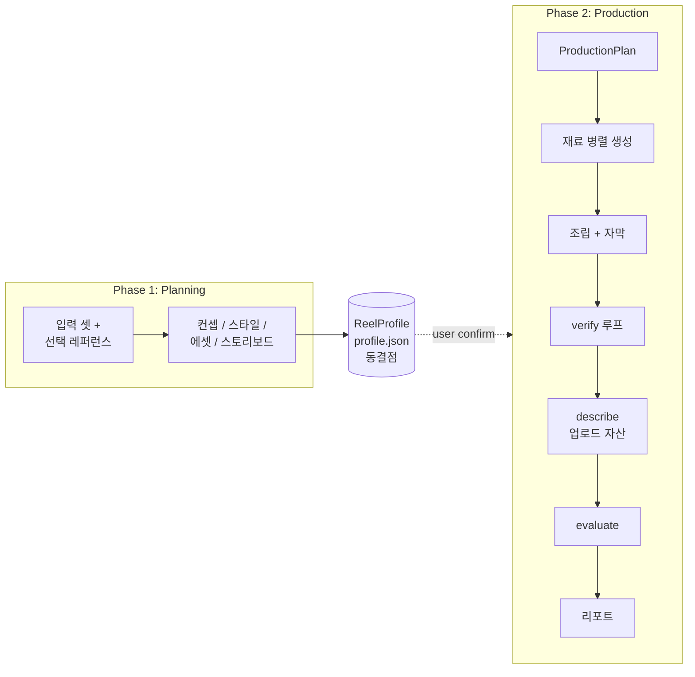
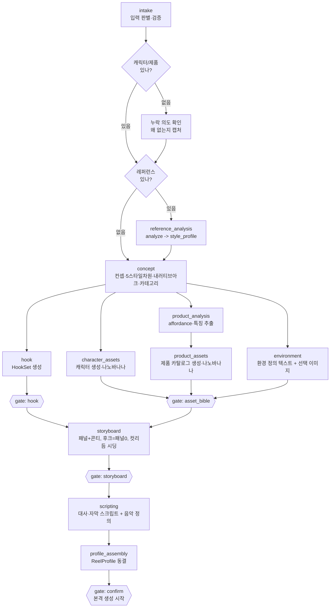
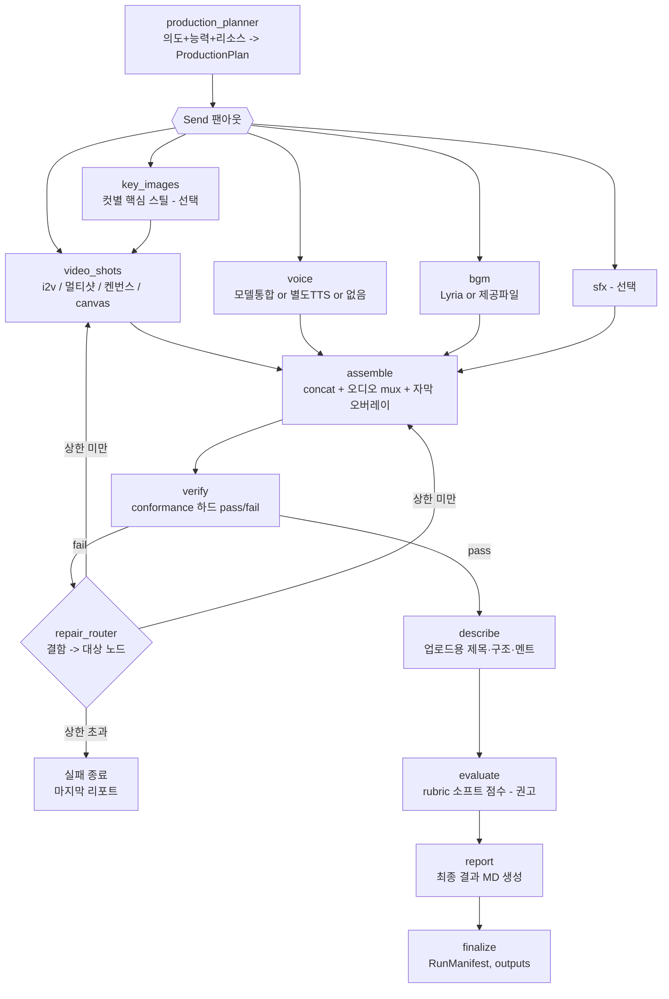

# 워크플로우: LangGraph StateGraph

상태: 확정(설계). 이 문서는 코어 LangGraph 그래프의 노드, 각 노드의 주요 task, 그리고
흐름을 정한다. 무엇을 만드는지는 [prd.md](prd.md), 사용자 경험과 게이트는
[product-design.md](product-design.md), 기술 스택은 [trd.md](trd.md), 단계 내부의
세부 계약은 [../docs/pipeline-design.md](../docs/pipeline-design.md)에 있다. 이 문서가
그래프 구조의 정본이다. 스키마는 `src/reel_gen_agent/generate/schema.py`가 정본이고,
이 문서가 요구하는 신규 스키마는 아래 "신규 스키마" 절에 명시한다.

## 한 줄 요약

그래프는 두 페이즈다. **기획(Planning)**이 입력 셋을 받아 에셋과 스토리보드를 거쳐
`ReelProfile`(= profile.json)로 동결되고, 사용자가 확인하면 **생산(Production)**이
그 profile을 받아 영상 모델 능력에 맞춰 재료를 병렬로 만들고 합친 뒤 검증한다. profile은
이식 가능한 창작 의도이고, 생산은 가용 리소스에 맞춰 그 의도를 해소한다. 같은 profile은
유사한 영상을 만든다.

## 두 페이즈와 동결점

- **동결점은 `ReelProfile`(profile.json) 하나다.** 기획의 모든 부산물(컨셉, 5가지 스타일
  차원, 내러티브 아크, 에셋 바이블, 스토리보드/콘티, 후크, 생산 의도)을 한 합본에 담는다.
  같은 profile이 들어오면 유사한 영상이 나와야 한다.
- **이식 의도 vs 실행 계획 분리.** `ReelProfile`은 *원하는* 생산 의도(voice 전략 선호,
  멀티샷 선호 등)만 담아 머신과 무관하게 이식된다. 런타임 `ProductionPlan`이 그 의도를
  가용 리소스(키, 모델 능력)에 맞춰 해소하고, 적용한 폴백을 `RunManifest`에 기록한다.

## 명령 매핑 (plan / execute / run / chat)

두 페이즈는 명령으로 분리 실행한다. CLI 계약의 정본은 [product-design.md](product-design.md).

| 명령 | 도는 페이즈 | 입력 -> 산출 |
|---|---|---|
| `plan <입력>` | Planning | 입력 -> `ReelProfile-{컨셉}-{생성일시}.json` |
| `execute <ReelProfile>` | Production | ReelProfile -> 영상 + report + upload |
| `run <입력>` | Planning + Production | 입력 -> 영상까지 한 번에(게이트 자동 통과) |
| `chat` | Planning + Production | 대화형 한 세션. confirm 게이트 통과 후 execute로 이어짐 |

두 페이즈는 `ReelProfile` 스키마로만 통신한다. 그래서 plan과 execute를 독립으로 개발하고
독립으로 실행할 수 있다(스키마 경계, [ADR.md](ADR.md) ADR-0003).

## 그래프 상태 (GraphState)

노드는 공유 상태를 읽고 쓴다. 핵심 필드:

| 필드 | 타입 | 의미 |
|---|---|---|
| `objective` | Objective | 영상 목적(필수). 없으면 그래프 진입 불가 |
| `character_input` | AssetInput \| None | 캐릭터 입력(이미지/URL/설명). 없으면 의도 캡처 |
| `product_input` | AssetInput \| None | 제품 입력. 없으면 의도 캡처 |
| `reference_ref` | str \| None | 선택 레퍼런스 영상/URL |
| `style_profile` | VideoProfile \| None | 레퍼런스 분석 산출 또는 LLM 유도 |
| `asset_bible` | AssetBible \| None | 캐릭터/제품 에셋 시트 |
| `storyboard` | Storyboard \| None | 패널 목록 + 콘티 |
| `reel_profile` | ReelProfile \| None | 기획 동결 산출(profile.json) |
| `production_plan` | ProductionPlan \| None | 런타임 해소 실행 계획 |
| `materials` | Materials | 생성된 재료(샷 클립, voice, bgm, sfx, 자막 PNG) |
| `manifest` | RunManifest | 노드별 실행 기록, 폴백, 산출물 경로 |
| `gate` | GateConfig | ask / pass / run 모드와 단계별 force-pass |
| `repair_count` | int | verify 재시도 카운트(상한 가드) |

## Phase 1: Planning

### 노드와 주요 task

- **intake (입력 판별·검증)**: 입력 셋을 판별한다. `objective`(영상 목적)는 필수이고
  없으면 진입을 막는다. `character_input`, `product_input`은 선택이되 **기본적으로 있다고
  가정**한다. 입력 형태 판별 규칙은 [product-design.md](product-design.md)를 따른다.
  **기본 로케일은 영어·미국 base다.** 특별한 언급이 없으면 영상 언어는 영어(`meta.language="en"`),
  대사·자막·캐릭터·배경은 미국을 기준으로 잡는다. 다른 언어나 지역은 입력이 명시할 때만 바꾼다.
- **누락 의도 확인 (ask_intent)**: 캐릭터나 제품이 없으면 *왜* 없는지 확인하고 의도로
  캡처한다. 없음은 곧 의도다(예: 캐릭터 없음 = 제품 단독/플랫레이, 제품 없음 = 브랜드
  무드). 이 의도가 이후 에셋 노드 실행 여부와 적격 내러티브 템플릿을 가른다. 런 모드에선
  기본 의도로 채우고 진행한다.
- **reference_analysis (선택)**: `reference_ref`가 있으면 `analyze`를 돌려 `style_profile`
  (`VideoProfile`)을 만든다. 이건 컷 리듬만이 아니라 **ReelProfile 베이스라인 전체의
  씨앗**이다. 톤, 페이싱, 컷 리듬, 자막 스타일, 후크, 음악 스타일/다이내믹, 내러티브 아크,
  기본 스토리보드 구조를 분석에서 끌어온다. 없으면 건너뛴다.
- **concept**: 컨셉을 펼치고 **5가지 스타일 차원**(톤, 페이싱, 후크, 자막 스타일, 컷 리듬)과
  **내러티브 아크**(이름 있는 템플릿)를 정한다. **레퍼런스가 있으면 ReelProfile을 최대한
  레퍼런스에서 생성한다.** 즉 분석된 style_profile을 베이스라인 초안으로 삼아 톤매너,
  편집, 음악 스타일, 스토리보드 구조까지 가져온 뒤, **영상 목적·캐릭터·제품에 맞춰 적응**
  시킨다(제품이 다르면 사용 장면과 후크가 바뀌고, 캐릭터가 다르면 룩과 표정이 바뀐다).
  레퍼런스가 없으면 LLM이 목적에서 처음부터 5차원과 베이스라인을 제안한다. **후크 생성은
  여기서 하지 않는다.** concept은 후크 유형 선택의 출발점인 카테고리와 톤을 정하고, 실제
  후크는 아래 hook 노드가 만든다. 기획·카피 LLM은 [ai-model-records.md](ai-model-records.md)
  2번을 따른다.
- **hook (별도 노드)**: 첫 1~3초 후크를 만드는 전용 노드다. 계약은
  [hook-generator.md](hook-generator.md), 배경·유형·예시는
  [../docs/hook-insight.md](../docs/hook-insight.md)다. `HookRequest`(제품, 카테고리, 톤,
  플랫폼, 언어, 길이)에서 LLM이 유형 1~3개(H1~H12)를 골라, 유형마다 텍스트·비주얼·오프닝
  서사 비트·본문 연결을 한 묶음으로 **비결정적(temperature)**으로 생성한다(필수 요건).
  출력은 `HookSet`이고 진입 함수는 `generate/hook.py::generate_hooks`다. 결정론 규칙(윈도
  길이, 유형 유효성, 낮은 적합도 가드, A/B 변형, 텍스트/비주얼 정합)은 코드가 강제한다.
- **gate: hook**: ask(후보 확인·편집·선택), pass(`--force-step-pass hook`이면 0번 후보
  자동 채택), run(자동 채택). 채택된 후크는 storyboard의 0번 패널(`beat="hook"`,
  `t_start=0`)로 펼쳐지고 narrative_arc의 첫 비트가 된다.
- **product_analysis (제품 분석, 별도 노드)**: 제품 이미지/설명에서 (1) 가능한 행동
  (`affordances`)과 (2) 카탈로그 필수 뷰에 쓸 특징(특수 기능 - 특이한 뚜껑/성분 느낌/
  언박싱 방식/착용 방식/질감 등)을 뽑는다. 스토리보드가 사용 장면에, product_assets가
  필수 뷰에 끌어 쓴다(상세: [../docs/pipeline-design.md](../docs/pipeline-design.md)).
- **character_assets (캐릭터 생성, 별도 노드, 나노바나나)**: 멀티뷰 시트 한 장을 기본으로
  만들되, **필수 뷰 체크리스트**(얼굴 클로즈업, 성격이 드러나는 표정 변화, 전신샷, 좌우
  얼굴)를 만족해야 한다. 디테일이 필요한 뷰만 개별 컷을 추가한다.
- **product_assets (제품 카탈로그 생성, 별도 노드, 나노바나나)**: 카탈로그 이미지를
  만든다. **필수 뷰 체크리스트**(정면, 좌우/위, 박스 안 모습, 특수 기능). product_analysis가
  뽑은 특징을 특수 기능 뷰에 반영한다. 특수 기능 매크로처럼 디테일이 필요한 뷰만 개별 컷.
- **environment (환경 정의, 별도 노드)**: 영상 컨셉과 스토리보드에 맞는 배경·촬영 환경을
  별도로 정의한다(장소, 세트, 조명, 시간대, 무드, 배경 소품). **텍스트 정의는 항상 만든다
  (필수)**. 텍스트만으로 일관성이 충분하면 이미지는 만들지 않고, 샷마다 같은 공간을
  유지해야 해 정의가 모호하면 **환경 레퍼런스 이미지를 나노바나나로 생성**한다(선택).
  생성 여부는 이 노드가 판단해 `EnvironmentSpec.needs_image`로 남긴다. 캐릭터·제품처럼
  잠금 에셋이라 모든 샷이 이 환경을 참조한다.
- **gate: asset_bible**: 캐릭터/제품/환경을 먼저 고정한다. 필수 뷰 체크리스트 충족 여부와
  환경 정의(이미지가 있으면 함께)를 보여주고 확인/수정받는다. 이후 모든 단계의 일관성
  기준이다.
- **storyboard**: 입력 + style_profile(컷 수/타이밍 시딩) + 내러티브 템플릿 + affordances
  + 환경 정의(EnvironmentSpec) + 플랫폼 제약을 합쳐 패널 목록과 콘티를 만든다. **텍스트
  콘티(패널 비트·타이밍·샷타입·프롬프트·자막)는 항상 채운다.** 각 패널은 잠긴 환경을
  참조하고(`environment_lock`), 플랫폼 세이프존/길이 상한/자막 가독성을 프롬프트에 자동
  주입한다. 패널 0은 항상 후크다. 컷 수와 타이밍은 레퍼런스가 있으면 style_profile 컷
  데이터로, 없으면 페이싱(fast_montage/mixed/slow_demo)으로 시딩한다.
  - **컷별 이미지 생성 규칙(조건부, 기본 off)**: 컷별 start image(Nano Banana)는 **보통
    만들지 않는다**. 텍스트 콘티로 충분하다. **여러 컷이 복잡하게 서로 다른 유형으로 짜인
    영상일 때만**(`needs_panel_images`: 컷 수가 많고 샷 타입이 다양) 켠다. 켤 때는 스토리보드
    패널 묘사 + 캐릭터 이미지 + 제품 이미지를 reference로 넣어 "이 컷의 첫 장면"을 생성한다
    (영상 모델에 직접 주입하진 않아도 컷별 일관성 확보에 쓴다). 단순/원컷 영상은 생략한다.
- **gate: storyboard**: 패널과 타이밍(있으면 컷별 스틸)을 image-to-video 비용 전에 승인한다.
- **scripting (대사·자막 스크립트 + 음악 정의, 하나의 노드)**: 셋을 한 노드 한 게이트로
  묶는다. 실제 TTS·BGM 생성은 production의 재료 노드가 따로 한다. 산출:
  - **대사(나레이션) 스크립트**: TTS로 만들 대사를 패널별로 쓴다. **voice는 되도록
    사용하되 기본 전달은 나레이션(`voiceover`)이다**([ADR.md](ADR.md) ADR-0012). 실측상
    나레이션이 가장 자연스럽고 구현이 쉽다. 전달 방식은 `voiceover`(화면과 분리된 TTS
    나레이션, **기본**), `on_camera`(영상 모델이 등장인물을 직접 말하게 함, 역동적 발화가
    필요한 컷에서만), `none`(음악 베드만) 중 정한다. **립싱크에 욕심내지 않는다**: 별도
    아바타 파이프라인도, voice를 먼저 만들어 영상 모델에 주입하는 립싱크도 쓰지 않는다.
    `on_camera`는 영상 모델 네이티브 발화로만 처리하되 **여러 컷에서 목소리 일관 + 립싱크가
    필요하면 Kling O3 Pro reference-to-video로만 가능**하다(ai-model-records.md 4·6번).
  - **voice는 반드시 캐릭터 설정에 맞춰 생성·정의한다(매우 중요).** `ModelSpec`(성별,
    나이, 룩, 분위기, 착장)에서 voice 톤·음색·딕션·억양을 유도해 `VoiceSpec`에 박는다.
    `on_camera`면 영상 모델이 그 캐릭터로 말하게 하고, `voiceover`여도 음색을 캐릭터에
    맞춘다. 대사 스크립트와 캐릭터 매칭 voice가 패널 타이밍에 정확히 붙는 것이 핵심
    요건이다(정렬은 production assemble가 보장).
  - **자막 스크립트**: 나레이션과 별개로 자막 텍스트를 만든다. `SubtitleSpec.density`
    (keyword/full_transcript)와 스타일에 따라 그대로 쓸지 축약할지 조정한다. 보통 핵심
    키워드형이라 전체 받아쓰기가 아니다. 패널별 `subtitle_text`를 채운다.
  - **음악 정의**: 생성까지는 하지 않고 스타일·유형·무드·다이내믹스와 컷 리듬 템포 정렬을
    정의한다(`MusicSpec`). 실제 BGM 생성·믹스는 production이 한다.

  기획·카피·대사 LLM은 변수로 관리한다(Claude vs Gemini, `TEXT_MODEL_PRIORITY`,
  [ai-model-records.md](ai-model-records.md) 2번). 어느 모델을 썼는지는 provenance에 남긴다.
- **gate: scripting**: 대사·전달방식·자막·음악 정의를 확인/수정한다. ask/pass/run 3-모드.
- **profile_assembly**: 위 모든 산출을 `ReelProfile`(profile.json)로 동결한다. 스타일
  출처(reference/llm), 레퍼런스 참조, 시드, 사용한 텍스트 모델을 provenance로 남긴다.
- **gate: confirm**: profile을 사용자에게 보여주고 확인받는다. 확인하면 **본격 생성
  시작**이다. 런 모드는 자동 통과한다.

## Phase 2: Production

### 노드와 주요 task

- **production_planner**: `ReelProfile`의 생산 의도를 받아, 선택된 영상 모델의
  **capability matrix**(멀티샷 지원, voice 동시 생성 지원, 최대 클립 길이, 해상도)와
  가용 리소스(키, 예산)에 맞춰 `ProductionPlan`을 해소한다. 결정 항목:
  - **voice 전략**: `voiceover`=별도 TTS 나레이션(**기본**) / `on_camera`=모델 네이티브 발화 /
    `none`=없음. voice는 되도록 켜되 기본은 voiceover다. `delivery=on_camera`인데 컷이
    여럿이면 목소리 일관을 위해 Kling O3 Pro reference-to-video를 요구하고, 그 백엔드가
    없으면 voiceover 나레이션으로 안전하게 내려간다.
  - **멀티샷**: 한 번에 멀티샷 호출 vs 샷별 짧게 뽑아 concat(모델 클립 한계 기준). 여러 컷
    품질·일관성은 Kling O3가 우위(ai-model-records.md 4번).
  - **샷 렌더러**: 패널별로 i2v / 켄 번스 폴백 / canvas(HTML+캔버스) 중 선택.
  - **컷별 key 이미지**: 컷별 start image 별도 생성 여부. 켜면 각 컷의 시작 프레임을
    Nano Banana로 따로 만든다(아래 key_images).
  - **bgm/sfx**: 생성/제공/없음, 효과음 on/off.
  적용한 폴백(예: 영상 키 없음 -> 켄 번스, on_camera 멀티컷인데 Kling 없음 -> voiceover)을
  `RunManifest`에 기록한다. 모델별 능력은 `.env`/config 데이터로 둔다(모델 비종속).
- **재료 노드(병렬, Send 팬아웃)**: ProductionPlan이 켠 재료만 돈다.
  - **key_images(선택)**: **컷별 start image를 Nano Banana로 만든다.** 시작 프레임에
    캐릭터 얼굴·제품이 제대로 들어가야 그 컷에서 일관성이 보존된다. 영상 백엔드가 Veo든
    Kling이든 컷마다 따로 만들어 video_shots에 주입한다.
  - **video_shots**: 패널별 image-to-video. 멀티샷 모델이면 한 번에, 아니면 샷별 생성 후
    concat. 개발 기본은 Veo 3.1 Fast(Vertex), 전환 시 Kling O3. **Kling O3 reference-to-video는
    캐릭터·제품 카탈로그 이미지(asset_bible)를 reference로 직접 주입할 수 있어 일관성에
    유리**하다. 영상 모델이 꺼지면 켄 번스 모션 폴백, canvas 샷이면 HTML+캔버스 렌더.
  - **voice**: 되도록 켠다. 기본 `voiceover`면 여기서 **ElevenLabs `eleven_v3`(한국어/영어
    공통 기본, 없을 때만 Google TTS 3.1 preview 폴백)**로 캐릭터 음색의 나레이션을 길게
    생성한다(컷이 나뉘어도 톤 일관). `on_camera`면
    video_shots가 캐릭터 발화를 함께 낸다(별도 voice 파일 주입 없음). **어느 쪽이든 voice는
    캐릭터 설정(`ModelSpec`)에서 유도한 `VoiceSpec`으로 만든다(매우 중요).**
  - **bgm**: Lyria 생성 또는 제공 파일. 컷 리듬과 템포를 맞춘다.
  - **sfx(선택)**: 효과음.
- **assemble**: 결정론 조립이다. 샷 클립 concat, 트랜지션, 오디오 mux(voice/bgm/sfx),
  pilmoji 투명 자막 PNG 오버레이(컬러 이모지 보존), 워터마크. 산출은 final.mp4.
  **voiceover일 때 대사 스크립트의 패널별 타이밍에 voice를 정렬해 붙이는 책임이 여기
  있다**(on_camera는 영상 모델이 발화를 품고 나오므로 정렬이 이미 맞는다).
- **verify (conformance, 하드 pass/fail)**: 결과물이 의도한 템플릿대로 온전히 만들어졌고
  노드 산출물이 빠짐없이 머지됐는지 검증한다. 계약은
  [conformance-gate.md](conformance-gate.md).
- **repair_router (유한 루프)**: verify가 fail이면 결함 카테고리를 대상 노드로 매핑한다
  (약한 샷 -> video_shots 재생성, 자막 위치 -> assemble 재조립, 볼륨 -> 오디오 remux 등).
  전체를 다시 만들지 않고 해당 노드만 다시 돌려 합친다. `repair_count` 상한을 두고,
  초과하면 마지막 리포트와 함께 실패로 종료한다.
- **describe (업로드 자산)**: verify를 통과하면 추가로 생성한 영상을 그대로 올릴 수 있게
  업로드용 자산을 만든다. (1) **업로드용 영상 제목**, (2) **간단한 영상 구조**(분초 단위
  `mm:ss: 주요 내용`), (3) **본문에 넣을 멘트**(영상 컨셉에 맞춰 짧게 또는 자세히, 제품명
  포함). 산출은 `upload.md`로 떨어진다. 스키마는 [information-schema.md](information-schema.md)의
  `UploadKit`. verify를 통과한 영상에만 의미가 있어 evaluate 앞에 둔다.
- **evaluate (rubric, 소프트 점수, 권고)**: verify를 통과한 영상만 드라이버 Rubric으로
  채점한다(D1~D7, D1·D2 곱셈 게이트). **점수와 서술만 내고 자동 루프는 돌지 않는다.**
  계약은 [rubric.md](rubric.md).
- **report (최종 결과 MD)**: 이번 회차를 사람이 읽는 한 장 리포트(`report.md`)로 묶어
  낸다. **맨 앞단에 원본 유저 입력**(영상 목적, 캐릭터/제품 입력 또는 없음 사유, 레퍼런스,
  텍스트 브리프)을 실어 "어떤 입력이 이 결과를 냈는지"를 먼저 보이고, **맨 뒤에 노드별
  핵심 프롬프트 원문**을 실어 "어떤 프롬프트가 무엇을 만들었는지"를 추적 가능하게 한다.
  본문에 담는 것: (1) 결과 영상에 대한 **최종 의견**(conformance·rubric·영상을 종합한 LLM
  서술), (2) **생성에 쓰인 노드 그래프 흐름**(`RunManifest.nodes` 기반), (3) **사용한
  모델**(텍스트/이미지/영상/저지 모델 ID와 lane), (4) **BGM 출처와 모델**(생성 모델 또는
  제공 파일), (5) **eval 결과 점수 정리**(rubric gated/flat과 D1~D7, conformance pass와
  체크 요약), (6) **바이럴 효과 예측**(후크·완시청 차원 D1·D2를 근거로 한 예측 서술).
  데이터 출처는 `ReelProfile`, `RunManifest`(ProductionPlan과 노드별 프롬프트 포함),
  `RubricResult`, `ConformanceReport`다. 스키마는 [information-schema.md](information-schema.md)의
  `FinalReport`. report.md는 이 `FinalReport`에서 렌더링한다(렌더링은 결정론, 최종 의견과
  예측 서술만 LLM).
- **finalize**: `RunManifest`를 마무리하고 산출물을 보존한다. **출력 폴더는
  `outputs/<run_id>/`이고 `run_id`는 `간단제목축약-생성일시`**(예:
  `glow-serum-reel-20260630-204512`) 형태다. 폴더 안에는 **핵심 산출물 3종**이 반드시
  들어간다.
  - `final.mp4` - 결과 영상
  - `report.md` - 최종 결과 리포트(report 노드)
  - `upload.md` - 업로드용 제목·구조·멘트(describe 노드)

  여기에 재현용 부산물(`profile.json`, `run.json`, `assets/`, `storyboard/`, `panels/`)을
  함께 둔다.

## 게이트 동작

모든 게이트(asset_bible, storyboard, confirm)는 같은 추상 위에서 동작한다. ask(챗 기본,
확인/수정), pass(`--force-step-pass <step>`), 런 모드(전부 통과). verify는 게이트가 아니라
하드 검증 루프다(통과해야 다음으로 간다). 자세한 동작은
[product-design.md](product-design.md).

## 스키마

이 그래프가 주고받는 모든 데이터 계약(ReelProfile, Objective, AssetInput, StyleDimensions,
Hook, ProductionPlan, ModelCapability, Materials와 기존 스키마 변경점)은 짝꿍 문서
[information-schema.md](information-schema.md)가 정본이다. 여기서는 중복하지 않는다.
`generate/schema.py` 조정 체크리스트도 그 문서에 있다.

## 재현성

같은 `ReelProfile`은 유사한 영상을 만든다. profile에 시드를 박아 결정론 부분(컷 타이밍,
조립)을 재현한다. 후크 생성은 설계상 비결정적(temperature)이라 완전 동일이 아니라 유사를
보장한다. `ProductionPlan`은 머신마다 가용 리소스가 달라 결과가 갈릴 수 있으므로, 적용한
폴백을 `RunManifest`에 남겨 차이를 추적 가능하게 한다.

## 단계적 구현

[../docs/pipeline-design.md](../docs/pipeline-design.md) "첫 구현 범위"를 따른다. 워킹
스켈레톤은 손으로 쓴 입력에서 켄 번스 폴백으로 끝까지 도는 못생긴 한 편이다. 그다음
순서로 깊인다.

1. 워킹 스켈레톤: intake -> asset_bible -> storyboard -> (켄 번스) assemble -> verify ->
   describe -> evaluate -> report. 게이트 프레임워크 포함.
2. production_planner와 capability matrix, Send 팬아웃 병렬 재료 생성.
3. concept / hook / product_analysis / profile_assembly로 기획 페이즈 완성.
4. voice/bgm/sfx 분기, 멀티샷, canvas 샷 렌더러.

canvas(HTML+캔버스) 샷 렌더러와 voice 통합 경로는 Phase 2 확장으로 둔다.
